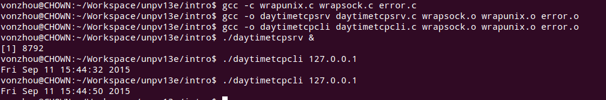
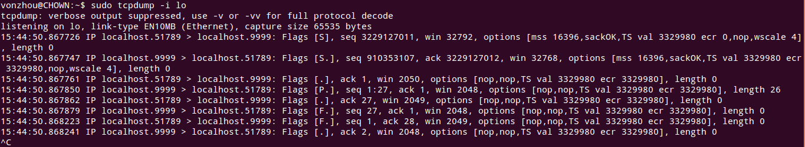
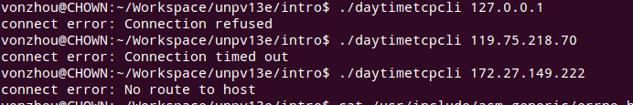
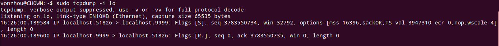
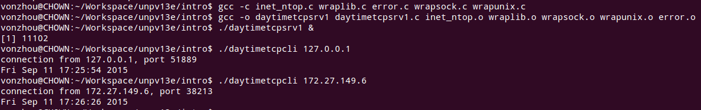

# 1. 简介
---

### 时间获取客户端服务器端程序入门, [daytimetcpcli.c](daytimetcpcli.c), [daytimetcpsrv.c](daytimetcpsrv.c)

运行效果：

一次请求的抓包结果：

# 3. 套接字编程简介
---

### 确定主机字节序 [byteorder.c](byteorder.c)

# 4. 基本TCP套接字编程
---

### 使用daytimetcpcli这个程序来看connect不同的出错情况

当某主机没有运行对应的服务时，立即回应一个RST包，抓包如下：

### 显示客户端IP地址和端口号的时间获取服务器 [daytimetcpsrv1.c](daytimetcpsrv1.c)

