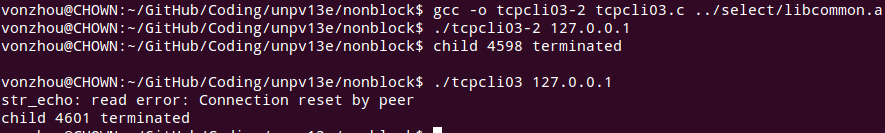
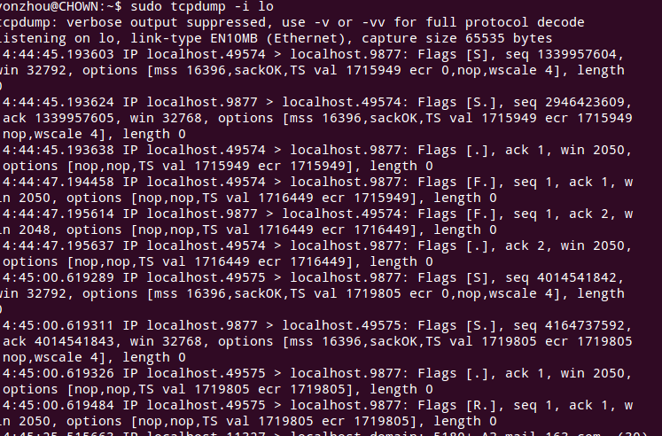

# 16 非阻塞I/O
---

### 非阻塞版本 [str_cli](strclinonb.c) 比较复杂，简单方案是利用多个进程 [strclifork.c](strclifork.c)

各个版本 **str_cli** 函数复制2000行文本时间对比：

### 非阻塞 [connect 函数](../lib/connect_nonb.c)

### 建立连接并发给一个RST的TCP回射客户端 [tcpcli03.c](tcpcli03.c)

下面测试，1）connect然后sleep后close，可以看到有正常的终止序列；2）利用**SO_LINGER**选项，可到发送了RST，没有通常的FIN序列。

