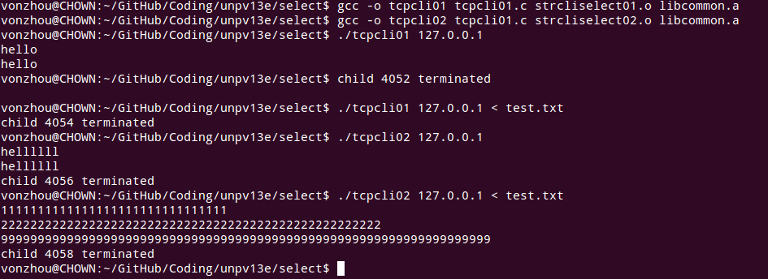

# IO复用-select,poll,epoll函数
---

### 使用slect的str_cli函数

问题是：当批量输入的时候可以看到，客户端并没有回显任何的内容就退出了！

### 使用shutdown后可以正确的处理批量输入

[strcliselect02.c](strcliselect02.c) 不再以文本行操作(readline, fgets)

### 使用select的回射服务器 [tcpservselect01.c](../tcpcliserv/tcpservselect01.c)

[存在的一个问题 16.6](../noblock/)
