# 5 TCP客户/服务器程序示例
---

### 5.6/5.7 正常启动/终止

[tcpserv01.c](tcpserv01.c), [tcpcli01.c](tcpcli01.c), [str_echo.c](../lib/str_echo.c), [str_cli.c](../lib/str_cli.c)

(后面开始，把所有需要的包裹函数在lib目录下面ar成一个整体libcommon.a，更清晰！)

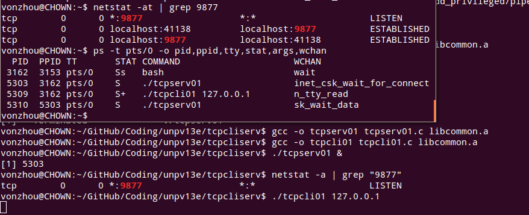

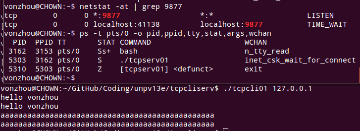

可以看到客户端主动关闭的经历的 **TIME_WAIT** 状态，服务端子进程终止后发给父进程的信号默认动作是忽略，所以没有处理子进程的终止状态，所以其成为了僵尸进程。

### 5.9 处理SIGCHLD信号

[tcpserv02.c](tcpserv02.c), [sigchildwait.c](sigchildwait.c)

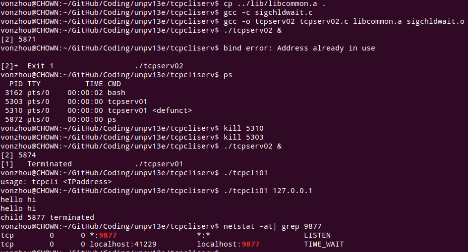

### 5.10 当多个客户端同时终止的时候，通过wait无法消除所有的僵尸进程

[tcpserv03.c](tcpserv03.c), [tcpcli04.c](tcpcli04.c)

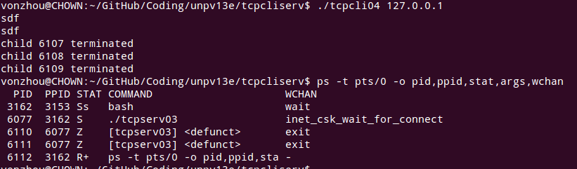

通过使用waitpid(), 并且处理accept被中断的正确服务器版本 [tcpserv04.c](tcpserv04.c)

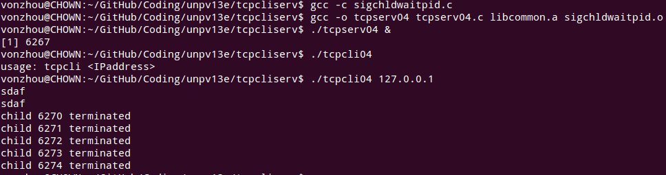

### 5.12 服务器进程终止，客户端阻塞在fgets上会导致问题

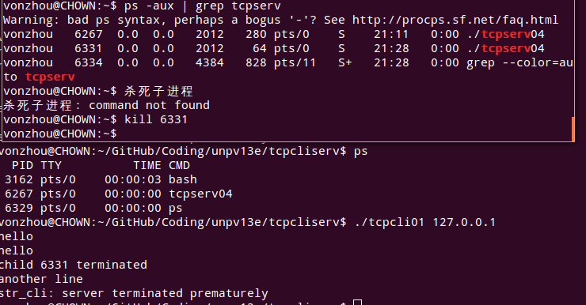

验证的确发送了RST！

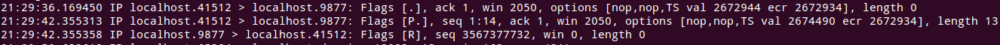

### 5.13 向已经收到RST的socket写，内核会给进程发射SIGPIPE信号

[str_cli11.c](str_cli11.c), [tcpcli11.c](tcpcli11.c)

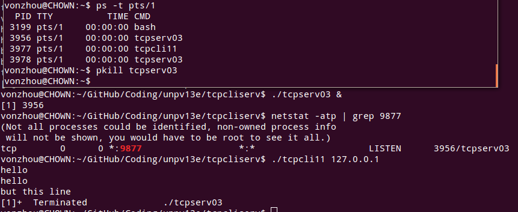

在程序[tcpcli11.c](tcpcli11.c)中增加对SIGPIPE的捕获，以证明的确其产生了，然后exit进程。

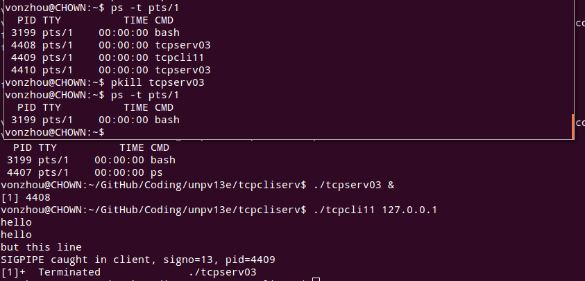

### 5.18 约定数据格式

在客户与服务端传递文本串，空格分割的俩整数，然后求和返回

[str_cli.c](str_cli)不变，服务端修改为[str_echo08.c](str_echo08.c)

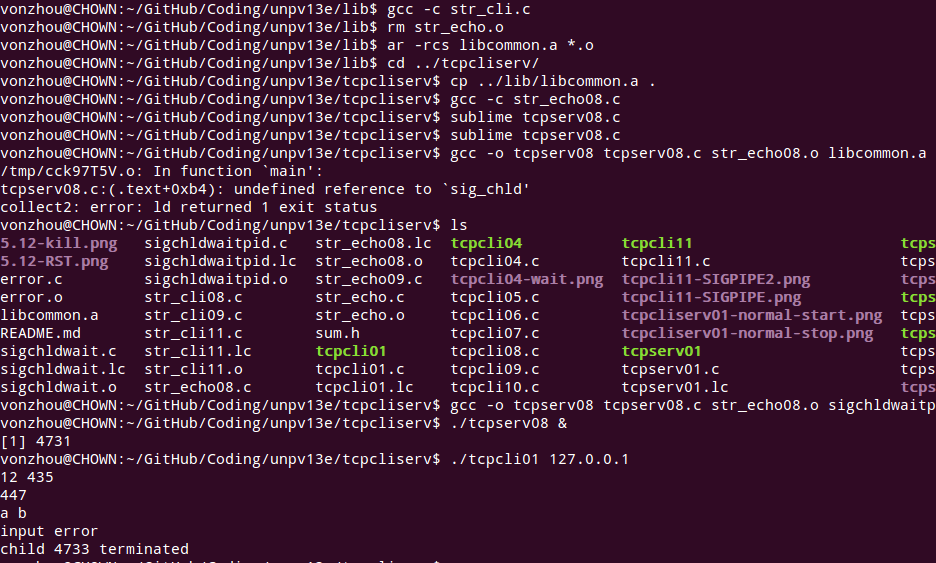

客户与服务端传递自定义的二进制格式，存在潜在问题

[str_cli09.c](str_cli09.c), [str_echo09.c](str_echo09.c), [sum.h](sum.h)

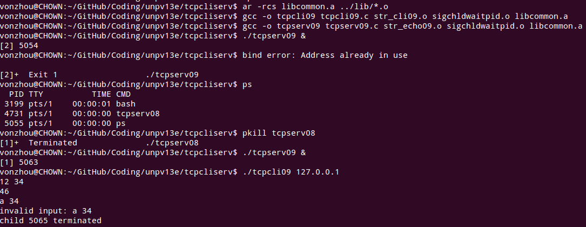

