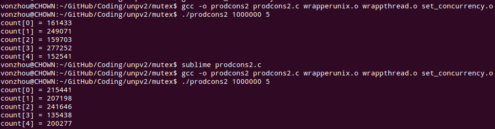

# 7. 互斥锁和条件变量
---

### 1. 生产者消费者,没有任何同步  -- prodcons1 ;

没有同步的时候 都被一个线程完成了所有的工作，结果不确定

### 2. 只同步所有的生产者  [prodcons2](prodcons2.c) 

在注释掉 **set_concurrency** 时候仍然多个线程均匀执行，而非第一个线程

### 3. 生产者轮询等待第i个item准备好  --prodcons3 ;

条件变量等待      -- prodcons6 ;

