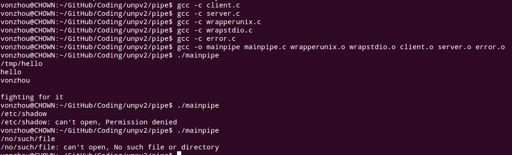
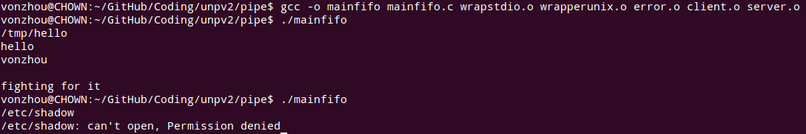
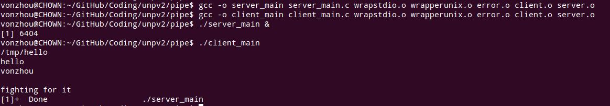
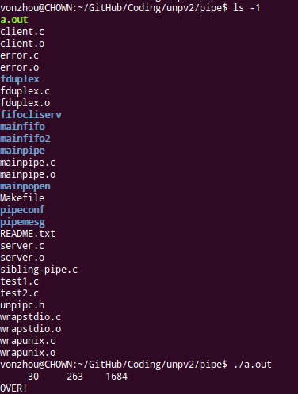

# 管道和FIFO
---

### 使用两个pipe实现全双工通信的 客户-服务器程序  [mainpipe](mainpipe.c);

父进程从标准输入中得到文件名，然后传递给子进程，然后子进程读取文件，把内容通过pipe传给父进程。

### 测试linux是否支持默认的全双工 fduplex

可以看到 Linux 不支持全双工的Pipe， 通过内核源码的实现很容易理解 !!! 

### 标准IO库提供的 popen 创建一个管道，并启动一个进程（执行指定的命令），然后调用进程与子进程通过管道通信，例子[mainpopen](mainpopen.c) 

由出错信息看到，在linux下面cat的出错信息很清晰，并且把出错写到了标准输出，否则我们的调用进程也不会看到。

相关：APUE 14.3

### 使用具名管道FIFO，改写上述的客户-服务端程序   [mainfifo](mainfifo.c)

分别有两个FIFO，代表client->server,server->client的数据流向，FIFO在文件系统中有一个名字，所以可以用于任何进程之间，这是比pipe的优势。

### 无亲缘关系的俩进程使用FIFO   [client_main.c](client_main.c), [server_main.c](server_main.c) ;

### 单个服务器多个客户 使用FIFO通信  -- fifocliserv ;

### 给管道增加消息头结构    -- pipemesg ;

###  sibling communicate by pipe, 2015-8-22 

利用pipe实现兄弟进程之间的通信 [sibling-pipe.c](sibling-pipe.c)

###

