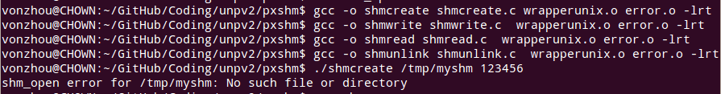
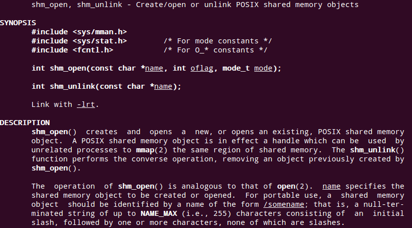
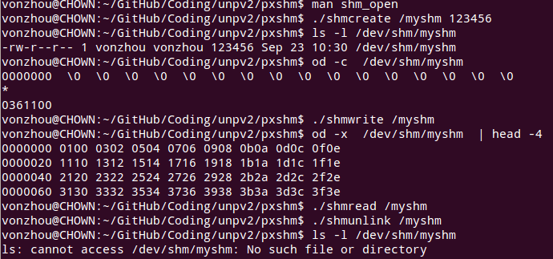
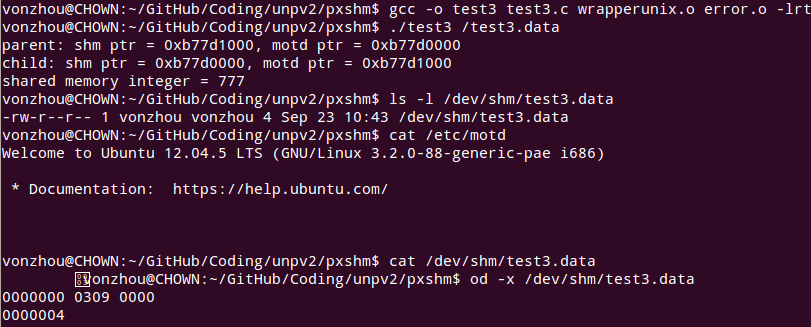
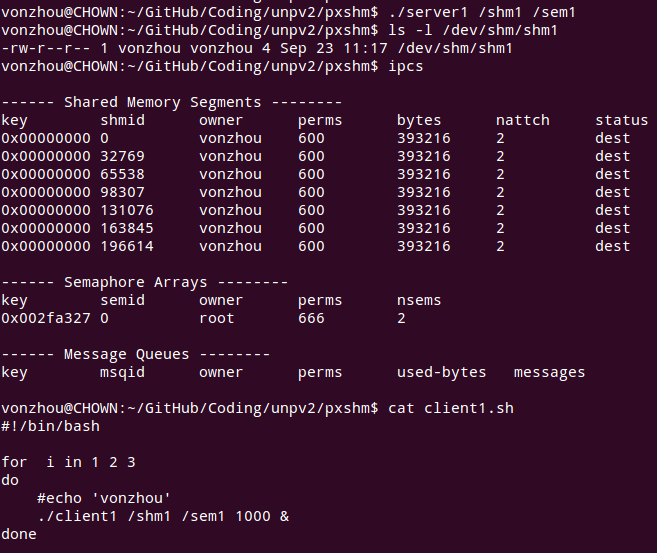
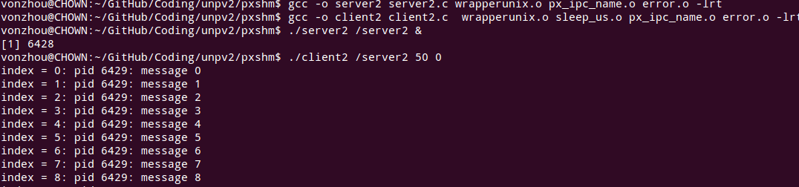
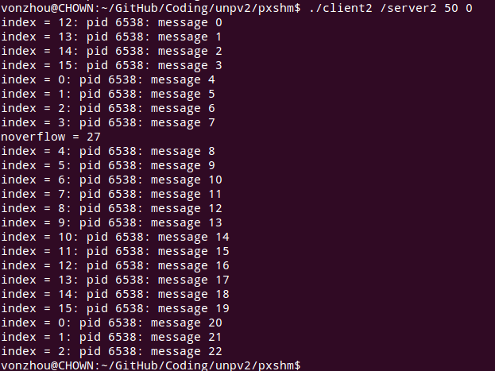

# Posix 共享内存区
---

### 创建共享内存区 [shmcreate.c](shmcreate.c)

** 看*shm_open* 的spec可以看到提供的IPC名字只能以/开头并且后面没有其他的/，本质上是在/dev/shm下面创建对应的路径。** 

### 删除共享内存区名字 [shmunlink.c](shmunlink.c)
### 写入共享内存区 [shmwrite.c](shmwrite.c)
### 读取共享内存区 [shmread.c](shmread.c)

### 上述程序的运行效果

### 共享内存区在不同的进程中可以出现在不同的地址  [test3.c](test3.c)

### 给共享内存中计数器加1   [server1.c](server1.c), [client1.c](client1.c)

### 通过共享内存向服务器发送消息，生产者消费  [server2.c](server2.c), [client2.c](client2.c)

**noverflow = 27 说明有27个消息因溢出而没有存入内存**

