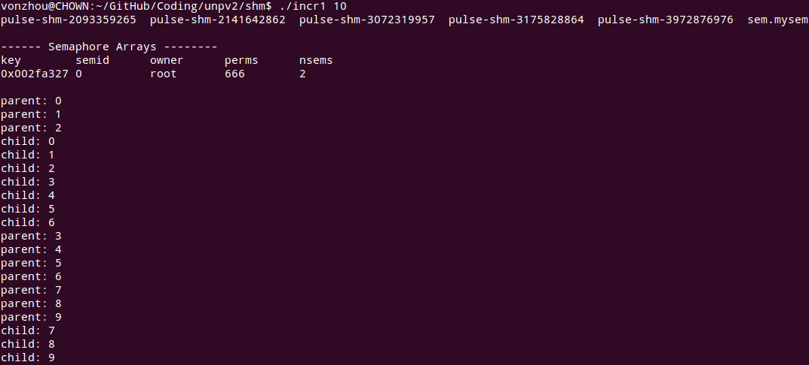
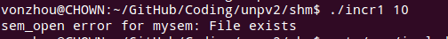
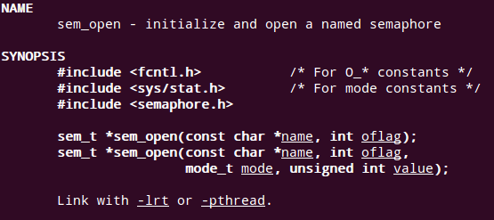
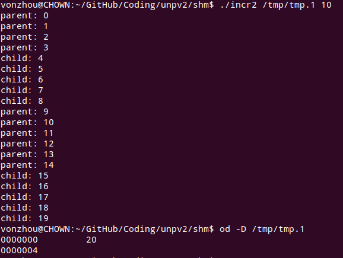
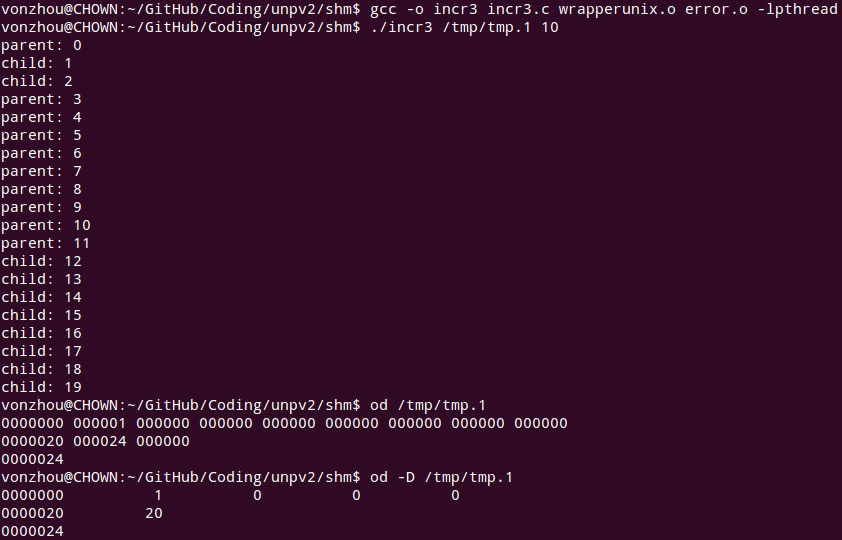
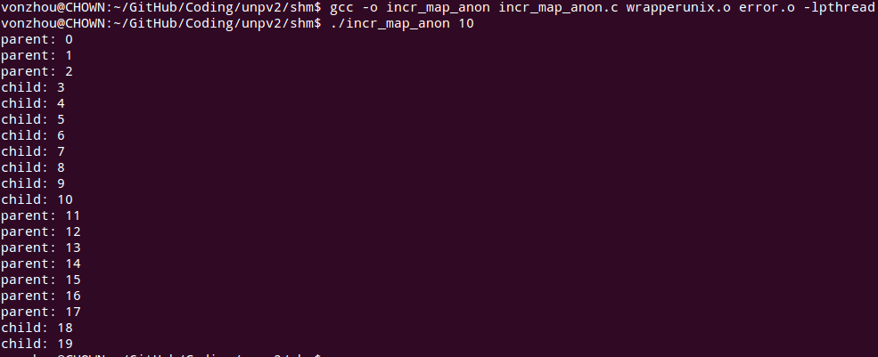
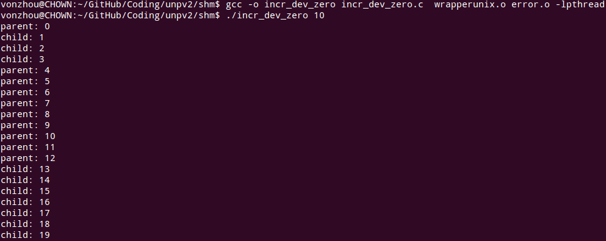
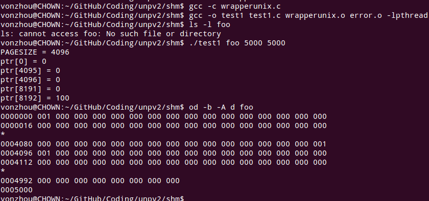
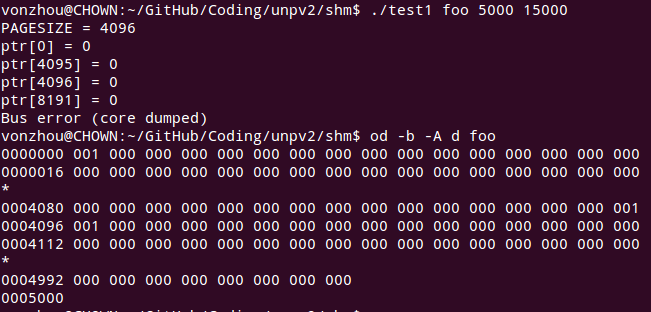
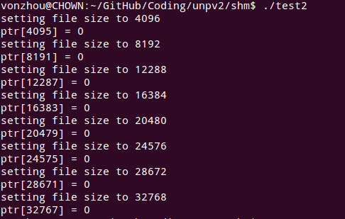

# 共享内存区介绍
---

### 父子进程给全局变量+1 [incr1.c](incr1.c)

该程序表明父子进程都有自己的一个count拷贝，然后各自++。

注意对 **sem_unlink** 的理解，引用计数大于0，只是将其name从文件系统中删除，但是对其的真真析构发生在最后一个**sem_close**的时候。本程序中的目的就是提前先 unlink 这样这个路径名就不再了，否则下次运行程序就会出现问题。

下面我们注释 Sem_unlink(SEM_NAME);  对应记录出现在了 /dev/shm/下面，所以原有代码跑不通，就是因为/dev下面没有对应的目录（/dev/shm/sem.tmp/mysem），所以直接提供名字即可。

**问题：**无论如何没有在ipcs中看到对应的记录？

**注意：**链接的时候要加-pthread，否则报错 undefined reference to `sem_open'

### 父子进程给共享内存区中的一个计数器+1 [incr2.c](incr2.c)

### 父信号量和计数器都在共享内存中 [incr3.c](incr3.c)

### 使用匿名共享内存区，父子进程给一个计数器+1 [incr_map_anon.c](incr_map_anon.c)

### 映射/dev/zero [incr_dev_zero.c](incr_dev_zero.c)

### 使用[test1.c](test1.c) 测试文件大小和映射内存区大小不同时的情景

1. 文件大小 = 映射内存区大小， Linux下访问映射区外面，没有出错

2. 文件大小 < 映射内存区大小，**SIGBUS**

### [test2.c](test2.c) 文件大小增长的内存区映射处理方法

