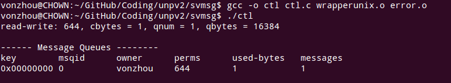
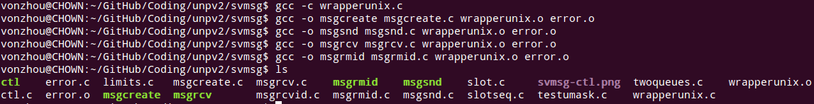
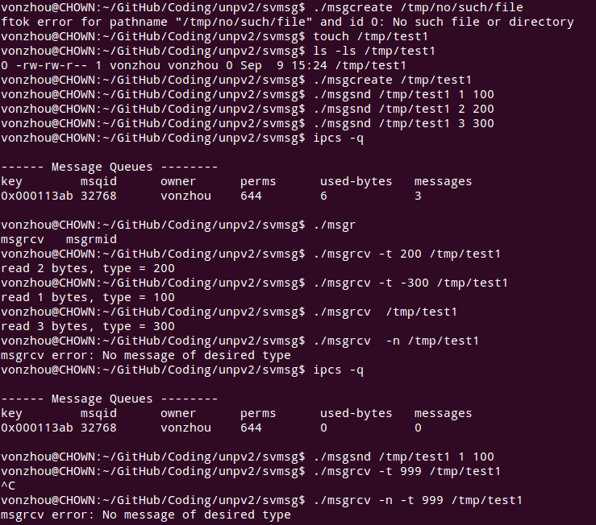
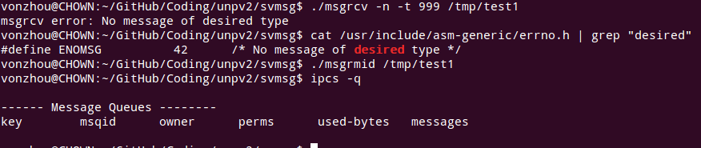
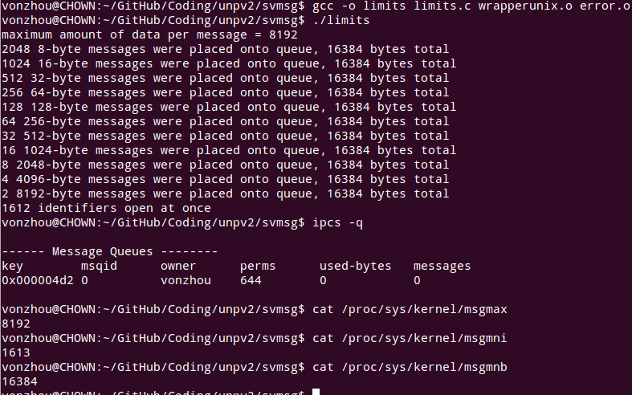

# System V 消息队列

---

[ctl.c](ctl.c) 创建一个消息队列，放1B消息，然后通过msgctl IPC_STAT命令查询其状态，使用system执行ipcs命令，最后删除队列。

[msgcreate.c](msgcreate.c) 创建一个消息队列。

[msgsnd.c](msgsnd.c) 指定消息类型和长度，写入消息队列。

[msgrcv.c](msgrcv.c) 指定阻塞类型及消息类型，读取消息。

[msgrmid.c](msgrmid.c) 删除消息队列。

### 示例-利用上述程序

使用不存在的路径创建消息队列会报错。

当读取一个不存在的消息类型时，读者会一直阻塞，这时可以指定非阻塞模式，返回ENOMSG。

### 使用两个消息队列实现前面的[客户-服务端程序](../svmsgcliserv/)，[回头看看](../pipemesg/)

### [整个应用一个队列](../svmsgmpx1q/)

### [每个客户一个队列](../svmsgmpxnq)

### System V 消息队列在Linux上的限制

可以看到通过[limits.c](limits.c)程序，和对系统参数的查看是一致的。

