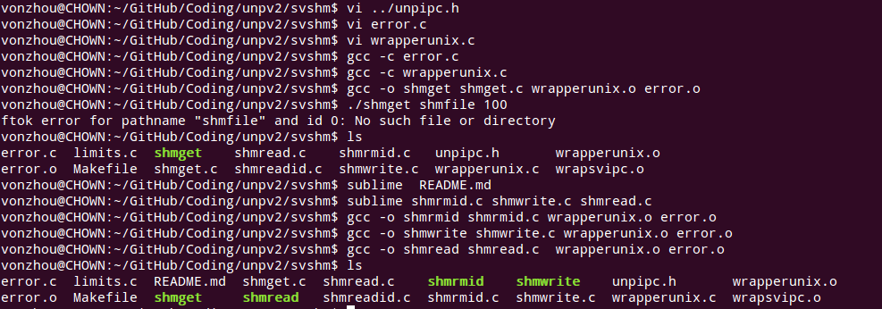

# System V Share Memory

---

首先你要熟悉下，Linux下System V 共享内存操作的API。

对shmget(), shmat()等的包装函数在wrapperunix.c中，编译得到可重定位目标文件。



在Linux下测试上述得到的各个可执行文件。

1. 创建一个大小为1234B的共享内存区，使用可执行文件shmget路径名标识该内存区的路径名。该进程退出后，共享区还在，通过ipcs命令可以看到附接数(nattach)=0。

2. 然后一次运行shmwrite , shmread验证，shmrmid删除，最后验证共享区的确被删了。


附，上面的4个程序为：

shmget:
```C
#include	"../lib/unpipc.h"

int
main(int argc, char **argv)
{
	int		c, id, oflag;
	char	*ptr;
	size_t	length;

	oflag = SVSHM_MODE | IPC_CREAT;
	while ( (c = Getopt(argc, argv, "e")) != -1) {
		switch (c) {
		case 'e':
			oflag |= IPC_EXCL;
			break;
		}
	}
	if (optind != argc - 2)
		err_quit("usage: shmget [ -e ] <pathname> <length>");
	length = atoi(argv[optind + 1]);

	id = Shmget(Ftok(argv[optind], 0), length, oflag);
	ptr = Shmat(id, NULL, 0);

	printf("shm addr : %p\n", ptr);

	exit(0);
}

```

shmrmid:
```C

```

shmwrite:
```C
#include	"../lib/unpipc.h"

int
main(int argc, char **argv)
{
	int		i, id;
	struct shmid_ds	buff;
	unsigned char	*ptr;

	if (argc != 2)
		err_quit("usage: shmwrite <pathname>");

	id = Shmget(Ftok(argv[1], 0), 0, SVSHM_MODE);
	ptr = Shmat(id, NULL, 0);
	Shmctl(id, IPC_STAT, &buff);

		/* 4set: ptr[0] = 0, ptr[1] = 1, etc. */
	for (i = 0; i < buff.shm_segsz; i++)
		*ptr++ = i % 256;

	exit(0);
}

```

shmread:
```C
#include	"../lib/unpipc.h"

int
main(int argc, char **argv)
{
	int		i, id;
	struct shmid_ds	buff;
	unsigned char	c, *ptr;

	if (argc != 2)
		err_quit("usage: shmread <pathname>");

	id = Shmget(Ftok(argv[1], 0), 0, SVSHM_MODE);
	ptr = Shmat(id, NULL, 0);
	Shmctl(id, IPC_STAT, &buff);

		/* 4check that ptr[0] = 0, ptr[1] = 1, etc. */
	for (i = 0; i < buff.shm_segsz; i++)
		if ( (c = *ptr++) != (i % 256)) //vonzhou: check the content pattern 
			err_ret("ptr[%d] = %d", i, c);

	exit(0);
}

```

参考：《UNPv2》
